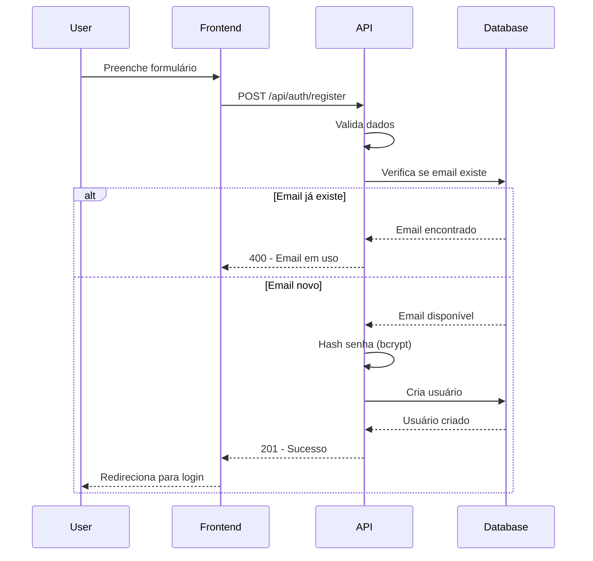
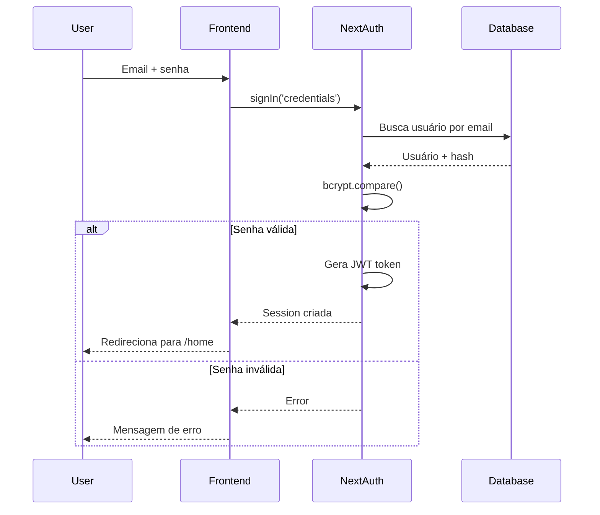

# API - Autenticação

Endpoints relacionados a autenticação e registro de usuários.

## Endpoints

### 1. Registrar Usuário

Cria uma nova conta de usuário com role `USER`.

**Endpoint**: `POST /api/auth/register`

**Autenticação**: ❌ Não requerida (pública)

#### Request Body

```json
{
  "name": "string (obrigatório)",
  "email": "string (obrigatório, deve ser único)",
  "password": "string (obrigatório)"
}
```

#### Respostas

**201 Created** - Usuário criado com sucesso

```json
{
  "message": "Usuário criado com sucesso",
  "userId": 123
}
```

**400 Bad Request** - Dados inválidos ou email duplicado

```json
{
  "error": "Todos os campos são obrigatórios"
}
```

ou

```json
{
  "error": "Email já está em uso"
}
```

**500 Internal Server Error** - Erro do servidor

```json
{
  "error": "Erro ao criar usuário"
}
```

#### Observações

- A senha é automaticamente hasheada com bcrypt antes de ser armazenada
- O usuário é criado com role `USER` por padrão
- Após registro, o usuário deve fazer login manualmente
- Campos opcionais como `igreja` e `social_name` não são aceitos neste endpoint

---

### 2. Registrar Usuário com Igreja

Cria uma nova conta de usuário incluindo o campo de igreja.

**Endpoint**: `POST /api/auth/register/igreja`

**Autenticação**: ❌ Não requerida (pública)

#### Request Body

```json
{
  "name": "string (obrigatório)",
  "email": "string (obrigatório, deve ser único)",
  "password": "string (obrigatório)",
  "igreja": "string (opcional)"
}
```

#### Respostas

**201 Created** - Usuário criado com sucesso

```json
{
  "message": "Usuário criado com sucesso",
  "userId": 123
}
```

**400 Bad Request** - Dados inválidos

```json
{
  "error": "Nome, email e senha são obrigatórios"
}
```

**500 Internal Server Error** - Erro do servidor

```json
{
  "error": "Erro ao criar usuário"
}
```

#### Observações

- Similar ao endpoint `/api/auth/register`, mas aceita o campo `igreja`
- Se `igreja` não for enviado, será salvo como `null`

---

### 3. NextAuth Endpoints

O NextAuth.js fornece endpoints adicionais para autenticação.

#### Login (Credentials)

**Endpoint**: `POST /api/auth/callback/credentials`

Gerenciado automaticamente pelo NextAuth. Use a função `signIn()` do lado do cliente:

```typescript
import { signIn } from 'next-auth/react'

const result = await signIn('credentials', {
  email: 'usuario@exemplo.com',
  password: 'senha123',
  redirect: false,
})

if (result?.error) {
  // Credenciais inválidas
  console.error(result.error)
} else {
  // Login bem-sucedido
  router.push('/home')
}
```

#### Verificar Sessão

**Endpoint**: `GET /api/auth/session`

Retorna a sessão atual do usuário.

**Resposta com sessão ativa**:

```json
{
  "user": {
    "id": 123,
    "name": "João Silva",
    "email": "joao@exemplo.com",
    "role": "USER",
    "socialName": null,
    "image": null
  },
  "expires": "2024-12-31T23:59:59.999Z"
}
```

**Resposta sem sessão**:

```json
{}
```

#### Logout

**Endpoint**: `POST /api/auth/signout`

Gerenciado automaticamente pelo NextAuth. Use a função `signOut()` do lado do cliente:

```typescript
import { signOut } from 'next-auth/react'

await signOut({ callbackUrl: '/login' })
```

---

## Fluxo de Autenticação

### 1. Registro



### 2. Login



---

## Segurança

### Hashing de Senhas

- **Algoritmo**: bcrypt
- **Salt rounds**: 10
- **Biblioteca**: `bcryptjs`

```typescript
import bcrypt from 'bcryptjs'

// Ao criar usuário
const hashedPassword = await bcrypt.hash(password, 10)

// Ao fazer login
const isValid = await bcrypt.compare(password, hashedPassword)
```

### JWT Tokens

- **Strategy**: JWT (stateless)
- **Assinatura**: `NEXTAUTH_SECRET` (variável de ambiente)
- **Conteúdo do token**:
  - `id` - ID do usuário
  - `email` - Email do usuário
  - `name` - Nome do usuário
  - `role` - Role do usuário (USER, ADMIN, MODERATOR)

### Cookies

- **Nome**: `next-auth.session-token` (ou `__Secure-next-auth.session-token` em HTTPS)
- **Flags**: HttpOnly, SameSite=Lax
- **Duração**: 30 dias (padrão NextAuth)

---

## Exemplos de Uso

### Registro via cURL

```bash
curl -X POST http://localhost:3000/api/auth/register \
  -H "Content-Type: application/json" \
  -d '{
    "name": "Maria Santos",
    "email": "maria@exemplo.com",
    "password": "senhaSegura123"
  }'
```

### Registro via JavaScript

```typescript
const response = await fetch('/api/auth/register', {
  method: 'POST',
  headers: {
    'Content-Type': 'application/json',
  },
  body: JSON.stringify({
    name: 'Maria Santos',
    email: 'maria@exemplo.com',
    password: 'senhaSegura123',
  }),
})

const data = await response.json()

if (response.ok) {
  console.log('Usuário criado:', data.userId)
  // Redirecionar para login
} else {
  console.error('Erro:', data.error)
}
```

### Login via Next-Auth

```typescript
'use client'

import { signIn } from 'next-auth/react'
import { useState } from 'react'
import { useRouter } from 'next/navigation'

export function LoginForm() {
  const [email, setEmail] = useState('')
  const [password, setPassword] = useState('')
  const router = useRouter()

  const handleSubmit = async (e: React.FormEvent) => {
    e.preventDefault()

    const result = await signIn('credentials', {
      email,
      password,
      redirect: false,
    })

    if (result?.error) {
      alert('Email ou senha inválidos')
    } else {
      router.push('/home')
    }
  }

  return (
    <form onSubmit={handleSubmit}>
      <input
        type="email"
        value={email}
        onChange={e => setEmail(e.target.value)}
        placeholder="Email"
        required
      />
      <input
        type="password"
        value={password}
        onChange={e => setPassword(e.target.value)}
        placeholder="Senha"
        required
      />
      <button type="submit">Entrar</button>
    </form>
  )
}
```

---

## Validações

### Registro

| Campo | Validação |
|-------|-----------|
| `name` | Obrigatório, string não vazia |
| `email` | Obrigatório, único, formato de email |
| `password` | Obrigatório, mínimo recomendado: 6 caracteres |
| `igreja` | Opcional, string |

### Login

| Campo | Validação |
|-------|-----------|
| `email` | Obrigatório, deve existir no banco |
| `password` | Obrigatório, deve corresponder ao hash |

---

## Erros Comuns

| Erro | Causa | Solução |
|------|-------|---------|
| `Email já está em uso` | Tentativa de registrar email duplicado | Use outro email ou faça login |
| `Todos os campos são obrigatórios` | Campos `name`, `email` ou `password` faltando | Preencha todos os campos |
| `CredentialsSignin` (NextAuth) | Email ou senha incorretos | Verifique as credenciais |
| `Configuration` (NextAuth) | `NEXTAUTH_SECRET` não configurado | Configure a variável de ambiente |

---

## Próximos Passos

- [ ] Adicionar verificação de email
- [ ] Implementar recuperação de senha
- [ ] Adicionar autenticação OAuth (Google, GitHub)
- [ ] Adicionar validação de força de senha
- [ ] Implementar rate limiting no registro
