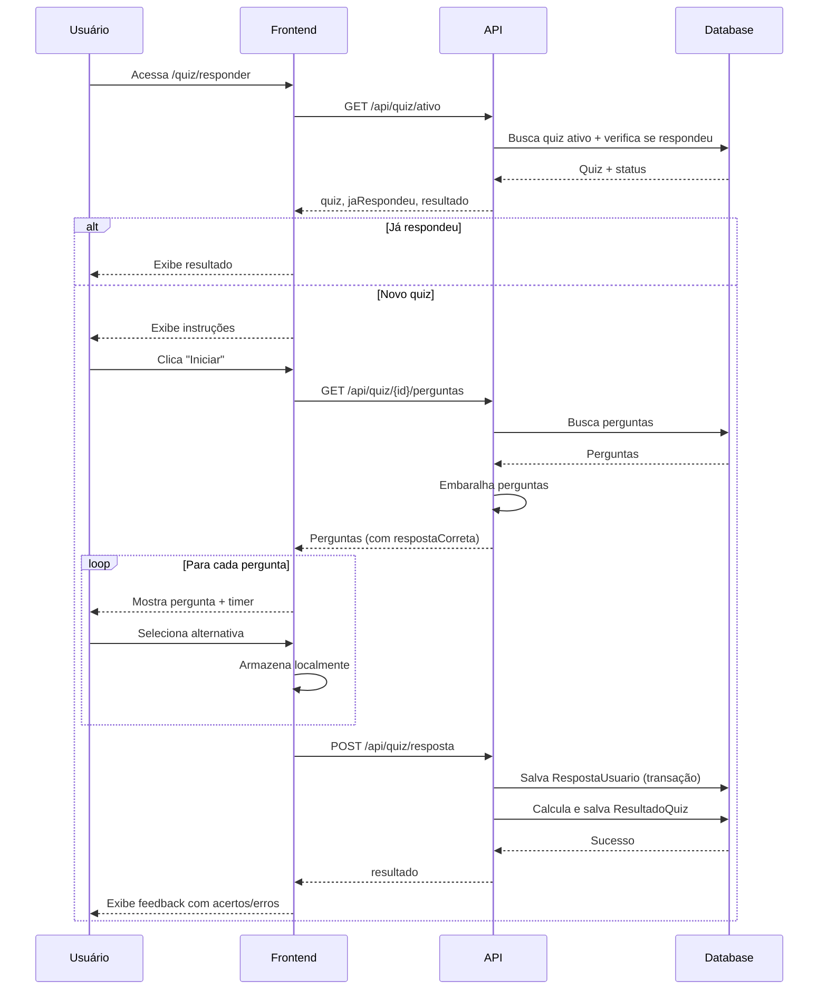

# API - Quiz

Endpoints para gerenciamento e resposta de quizzes.

## Índice

- [Gerenciamento (Admin)](#gerenciamento-admin)
  - [Listar Quizzes](#1-listar-quizzes)
  - [Criar Quiz](#2-criar-quiz)
  - [Atualizar Quiz](#3-atualizar-quiz)
  - [Deletar Quiz](#4-deletar-quiz)
  - [Criar Perguntas](#5-criar-perguntas)
  - [Listar Perguntas (Admin)](#6-listar-perguntas-admin)
- [Responder Quiz (Usuário)](#responder-quiz-usuário)
  - [Buscar Quiz Ativo](#7-buscar-quiz-ativo)
  - [Buscar Perguntas](#8-buscar-perguntas)
  - [Enviar Respostas](#9-enviar-respostas)
  - [Ver Resultado](#10-ver-resultado)
- [Rankings](#rankings)
  - [Classificação de um Quiz](#11-classificação-de-um-quiz)
  - [Classificação Geral](#12-classificação-geral)

---

## Gerenciamento (Admin)

Endpoints que requerem role `ADMIN`.

### 1. Listar Quizzes

Lista todos os quizzes criados.

**Endpoint**: `GET /api/quiz`

**Autenticação**: ✅ Requerida (ADMIN)

#### Respostas

**200 OK**

```json
{
  "quizzes": [
    {
      "id": 1,
      "tema": "Novo Testamento",
      "ativo": true,
      "createdAt": "2024-01-15T10:00:00.000Z",
      "updatedAt": "2024-01-15T10:00:00.000Z",
      "_count": {
        "perguntas": 10
      }
    }
  ]
}
```

**401 Unauthorized** - Não autenticado

**403 Forbidden** - Não é admin

---

### 2. Criar Quiz

Cria um novo quiz (inicialmente inativo).

**Endpoint**: `POST /api/quiz`

**Autenticação**: ✅ Requerida (ADMIN)

#### Request Body

```json
{
  "tema": "string (obrigatório)"
}
```

#### Respostas

**201 Created**

```json
{
  "message": "Quiz criado com sucesso",
  "quiz": {
    "id": 2,
    "tema": "Antigo Testamento",
    "ativo": false,
    "createdAt": "2024-01-20T14:30:00.000Z",
    "updatedAt": "2024-01-20T14:30:00.000Z"
  }
}
```

**400 Bad Request**

```json
{
  "error": "Tema é obrigatório"
}
```

**401 Unauthorized** - Não autenticado

**403 Forbidden** - Não é admin

---

### 3. Atualizar Quiz

Atualiza tema e/ou status de ativo de um quiz.

**Endpoint**: `PUT /api/quiz/{id}`

**Autenticação**: ✅ Requerida (ADMIN)

#### Parâmetros de Rota

- `id` - ID do quiz (número)

#### Request Body

```json
{
  "tema": "string (opcional)",
  "ativo": "boolean (opcional)"
}
```

#### Respostas

**200 OK**

```json
{
  "message": "Quiz atualizado com sucesso",
  "quiz": {
    "id": 1,
    "tema": "Novo Testamento - Revisado",
    "ativo": true,
    "createdAt": "2024-01-15T10:00:00.000Z",
    "updatedAt": "2024-01-20T15:00:00.000Z",
    "_count": {
      "perguntas": 10
    }
  }
}
```

**400 Bad Request** - ID inválido

**401 Unauthorized** - Não autenticado

**403 Forbidden** - Não é admin

**500 Internal Server Error** - Quiz não encontrado

#### Observações

- **Importante**: Ao ativar um quiz (`ativo: true`), todos os outros quizzes são automaticamente desativados
- Apenas 1 quiz pode estar ativo por vez

---

### 4. Deletar Quiz

Deleta um quiz e todas as suas perguntas e respostas (cascade).

**Endpoint**: `DELETE /api/quiz/{id}`

**Autenticação**: ✅ Requerida (ADMIN)

#### Parâmetros de Rota

- `id` - ID do quiz (número)

#### Respostas

**200 OK**

```json
{
  "message": "Quiz deletado com sucesso"
}
```

**400 Bad Request** - ID inválido

**401 Unauthorized** - Não autenticado

**403 Forbidden** - Não é admin

**500 Internal Server Error** - Quiz não encontrado

---

### 5. Criar Perguntas

Cria uma ou mais perguntas para um quiz.

**Endpoint**: `POST /api/quiz/{id}/perguntas`

**Autenticação**: ✅ Requerida (ADMIN)

#### Parâmetros de Rota

- `id` - ID do quiz (número)

#### Request Body (Pergunta Única)

```json
{
  "enunciado": "string (obrigatório)",
  "alternativaA": "string (obrigatório)",
  "alternativaB": "string (obrigatório)",
  "alternativaC": "string (obrigatório)",
  "alternativaD": "string (obrigatório)",
  "alternativaE": "string (obrigatório)",
  "respostaCorreta": "A|B|C|D|E (obrigatório)",
  "justificativa": "string (obrigatório)",
  "tempoSegundos": "number (obrigatório, > 0)"
}
```

#### Request Body (Múltiplas Perguntas)

```json
[
  {
    "enunciado": "...",
    "alternativaA": "...",
    // ... outros campos
  },
  {
    "enunciado": "...",
    "alternativaA": "...",
    // ... outros campos
  }
]
```

#### Respostas

**201 Created** (Pergunta Única)

```json
{
  "message": "Pergunta criada com sucesso",
  "pergunta": {
    "id": 15,
    "quizId": 1,
    "enunciado": "Quem foi o primeiro rei de Israel?",
    "alternativaA": "Davi",
    "alternativaB": "Saul",
    "alternativaC": "Salomão",
    "alternativaD": "Samuel",
    "alternativaE": "Moisés",
    "respostaCorreta": "B",
    "justificativa": "Saul foi o primeiro rei de Israel...",
    "tempoSegundos": 30,
    "createdAt": "2024-01-20T16:00:00.000Z",
    "updatedAt": "2024-01-20T16:00:00.000Z"
  }
}
```

**201 Created** (Múltiplas Perguntas)

```json
{
  "message": "5 pergunta(s) criada(s) com sucesso",
  "perguntas": [ /* array de perguntas */ ],
  "total": 5
}
```

**400 Bad Request** - Validação falhou

```json
{
  "error": "Erros de validação",
  "detalhes": [
    "Pergunta 1: Enunciado é obrigatório",
    "Pergunta 2: Resposta correta deve ser A, B, C, D ou E"
  ]
}
```

**401 Unauthorized** - Não autenticado

**403 Forbidden** - Não é admin

**404 Not Found** - Quiz não encontrado

#### Observações

- Todas as 5 alternativas são obrigatórias
- `respostaCorreta` deve ser exatamente: `"A"`, `"B"`, `"C"`, `"D"` ou `"E"`
- `tempoSegundos` define o tempo limite para responder a pergunta
- Perguntas são criadas em transação (ou todas ou nenhuma)

---

### 6. Listar Perguntas (Admin)

Lista todas as perguntas de um quiz para gerenciamento.

**Endpoint**: `GET /api/quiz/{id}/perguntas?admin=true`

**Autenticação**: ✅ Requerida (ADMIN)

#### Parâmetros de Rota

- `id` - ID do quiz (número)

#### Query Parameters

- `admin=true` - Obrigatório para retornar todas as perguntas com respostas corretas

#### Respostas

**200 OK**

```json
{
  "perguntas": [
    {
      "id": 15,
      "quizId": 1,
      "enunciado": "Quem foi o primeiro rei de Israel?",
      "alternativaA": "Davi",
      "alternativaB": "Saul",
      "alternativaC": "Salomão",
      "alternativaD": "Samuel",
      "alternativaE": "Moisés",
      "respostaCorreta": "B",
      "justificativa": "Saul foi o primeiro rei...",
      "tempoSegundos": 30,
      "createdAt": "2024-01-20T16:00:00.000Z",
      "updatedAt": "2024-01-20T16:00:00.000Z"
    }
  ]
}
```

**400 Bad Request** - ID inválido

**401 Unauthorized** - Não autenticado

**403 Forbidden** - Não é admin

---

## Responder Quiz (Usuário)

Endpoints disponíveis para usuários autenticados responderem quizzes.

### 7. Buscar Quiz Ativo

Retorna o quiz atualmente ativo e verifica se o usuário já respondeu.

**Endpoint**: `GET /api/quiz/ativo`

**Autenticação**: ✅ Requerida (USER ou ADMIN)

#### Respostas

**200 OK** - Quiz ativo encontrado (não respondido)

```json
{
  "quiz": {
    "id": 1,
    "tema": "Novo Testamento",
    "ativo": true,
    "totalPerguntas": 10
  },
  "jaRespondeu": false,
  "resultado": null
}
```

**200 OK** - Quiz ativo encontrado (já respondido)

```json
{
  "quiz": {
    "id": 1,
    "tema": "Novo Testamento",
    "ativo": true,
    "totalPerguntas": 10
  },
  "jaRespondeu": true,
  "resultado": {
    "total": 10,
    "acertos": 8,
    "erros": 2,
    "nulos": 0,
    "porcentagem": 80
  }
}
```

**200 OK** - Nenhum quiz ativo

```json
{
  "quiz": null,
  "jaRespondeu": false,
  "resultado": null
}
```

**401 Unauthorized** - Não autenticado

---

### 8. Buscar Perguntas

Busca as perguntas de um quiz para o usuário responder.

**Endpoint**: `GET /api/quiz/{id}/perguntas`

**Autenticação**: ✅ Requerida (USER ou ADMIN)

#### Parâmetros de Rota

- `id` - ID do quiz (número)

#### Respostas

**200 OK**

```json
{
  "perguntas": [
    {
      "id": 15,
      "enunciado": "Quem foi o primeiro rei de Israel?",
      "alternativaA": "Davi",
      "alternativaB": "Saul",
      "alternativaC": "Salomão",
      "alternativaD": "Samuel",
      "alternativaE": "Moisés",
      "tempoSegundos": 30,
      "respostaCorreta": "B",
      "justificativa": "Saul foi o primeiro rei..."
    }
  ]
}
```

**400 Bad Request** - Usuário já respondeu este quiz

```json
{
  "error": "Você já respondeu este quiz"
}
```

**400 Bad Request** - Quiz sem perguntas

```json
{
  "error": "Quiz não possui perguntas"
}
```

**401 Unauthorized** - Não autenticado

#### Observações

- Perguntas são **embaralhadas** aleatoriamente
- As perguntas incluem `respostaCorreta` e `justificativa` para feedback visual no frontend
- Se o usuário já respondeu o quiz, retorna erro 400

---

### 9. Enviar Respostas

Envia todas as respostas do usuário para um quiz.

**Endpoint**: `POST /api/quiz/resposta`

**Autenticação**: ✅ Requerida (USER ou ADMIN)

#### Request Body

```json
{
  "quizId": 1,
  "respostas": [
    {
      "perguntaId": 15,
      "alternativaEscolhida": "B"
    },
    {
      "perguntaId": 16,
      "alternativaEscolhida": "A"
    },
    {
      "perguntaId": 17,
      "alternativaEscolhida": null
    }
  ]
}
```

#### Campos

- `quizId` - ID do quiz (obrigatório)
- `respostas` - Array de respostas (obrigatório)
  - `perguntaId` - ID da pergunta (obrigatório)
  - `alternativaEscolhida` - `"A"|"B"|"C"|"D"|"E"|null` (null = não respondeu a tempo)

#### Respostas

**200 OK**

```json
{
  "resultado": {
    "total": 10,
    "acertos": 7,
    "erros": 2,
    "nulos": 1,
    "porcentagem": 70
  }
}
```

**400 Bad Request** - Já respondeu

```json
{
  "error": "Você já respondeu este quiz"
}
```

**400 Bad Request** - Validação falhou

```json
{
  "error": "Todas as perguntas devem ser respondidas"
}
```

ou

```json
{
  "error": "Alternativa inválida"
}
```

**401 Unauthorized** - Não autenticado

#### Observações

- **Todas** as perguntas do quiz devem estar no array `respostas`
- Respostas são salvas em **transação** (atomicidade)
- O `ResultadoQuiz` é calculado e salvo automaticamente
- Após envio, o usuário não pode responder o mesmo quiz novamente

---

### 10. Ver Resultado

Calcula e retorna o resultado do usuário em um quiz.

**Endpoint**: `GET /api/quiz/{id}/resultado`

**Autenticação**: ✅ Requerida (USER ou ADMIN)

#### Parâmetros de Rota

- `id` - ID do quiz (número)

#### Respostas

**200 OK**

```json
{
  "total": 10,
  "acertos": 8,
  "erros": 2,
  "porcentagem": 80
}
```

**400 Bad Request** - Quiz sem perguntas

```json
{
  "error": "Quiz não possui perguntas"
}
```

**401 Unauthorized** - Não autenticado

#### Observações

- Calcula o resultado em tempo real a partir das respostas salvas
- Usado para exibir feedback após responder o quiz

---

## Rankings

### 11. Classificação de um Quiz

Retorna o ranking de um quiz específico.

**Endpoint**: `GET /api/quiz/{id}/classificacao?limit=50`

**Autenticação**: ✅ Requerida (USER ou ADMIN)

#### Parâmetros de Rota

- `id` - ID do quiz (número)

#### Query Parameters

- `limit` - Número de resultados (padrão: 50)

#### Respostas

**200 OK**

```json
{
  "classificacao": [
    {
      "posicao": 1,
      "userId": 10,
      "nome": "Maria Santos",
      "social_name": null,
      "email": "maria@exemplo.com",
      "acertos": 10,
      "erros": 0,
      "nulos": 0,
      "total": 10,
      "porcentagem": 100
    },
    {
      "posicao": 2,
      "userId": 5,
      "nome": "João Silva",
      "social_name": "João",
      "email": "joao@exemplo.com",
      "acertos": 9,
      "erros": 1,
      "nulos": 0,
      "total": 10,
      "porcentagem": 90
    }
  ]
}
```

**400 Bad Request** - ID inválido

**401 Unauthorized** - Não autenticado

#### Observações

- Ordenado por:
  1. Acertos (descendente)
  2. Data de conclusão (ascendente) - em caso de empate, quem respondeu primeiro fica na frente
- Usa índice do banco para performance

---

### 12. Classificação Geral

Retorna o ranking geral de todos os quizzes (top 10).

**Endpoint**: `GET /api/quiz/classificacao-geral`

**Autenticação**: ✅ Requerida (USER ou ADMIN)

#### Respostas

**200 OK**

```json
{
  "classificacao": [
    {
      "posicao": 1,
      "userId": 10,
      "nome": "Maria Santos",
      "social_name": null,
      "email": "maria@exemplo.com",
      "totalAcertos": 85,
      "totalQuizzes": 10,
      "mediaPorcentagem": 85
    },
    {
      "posicao": 2,
      "userId": 5,
      "nome": "João Silva",
      "social_name": "João",
      "email": "joao@exemplo.com",
      "totalAcertos": 78,
      "totalQuizzes": 9,
      "mediaPorcentagem": 87
    }
  ]
}
```

**401 Unauthorized** - Não autenticado

#### Observações

- Agrega resultados de **todos os quizzes**
- Ordenado por:
  1. Total de acertos (descendente)
  2. Data do primeiro quiz (ascendente) - desempate
- Retorna **top 10** usuários
- `mediaPorcentagem` é calculada a partir de todos os quizzes respondidos

---

## Fluxo Completo: Responder Quiz



---

## Regras de Negócio

### Quiz Ativo

- Apenas **1 quiz** pode estar ativo por vez
- Ao ativar um quiz, os demais são desativados automaticamente
- Usuários só podem responder o quiz ativo

### Respostas

- Usuário só pode responder cada quiz **uma vez**
- Todas as perguntas devem ser respondidas (pode ser `null` se tempo esgotou)
- Respostas são validadas contra o quiz (pergunta deve pertencer ao quiz)

### Resultado

- Calculado automaticamente ao enviar respostas
- **Acertos**: alternativa escolhida === respostaCorreta
- **Erros**: alternativa escolhida !== respostaCorreta
- **Nulos**: alternativa escolhida === null
- **Porcentagem**: (acertos / total) * 100

### Rankings

- Classificação de quiz: apenas usuários que responderam aquele quiz
- Classificação geral: soma de acertos de todos os quizzes
- Desempate: quem respondeu primeiro

---

## Exemplo Completo de Uso

Ver [arquitetura.md](../arquitetura.md#fluxo-principal-responder-quiz) para fluxo visual detalhado.
