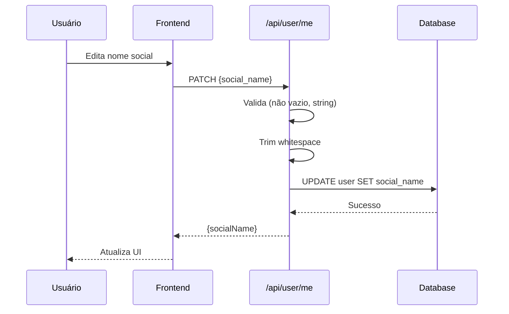
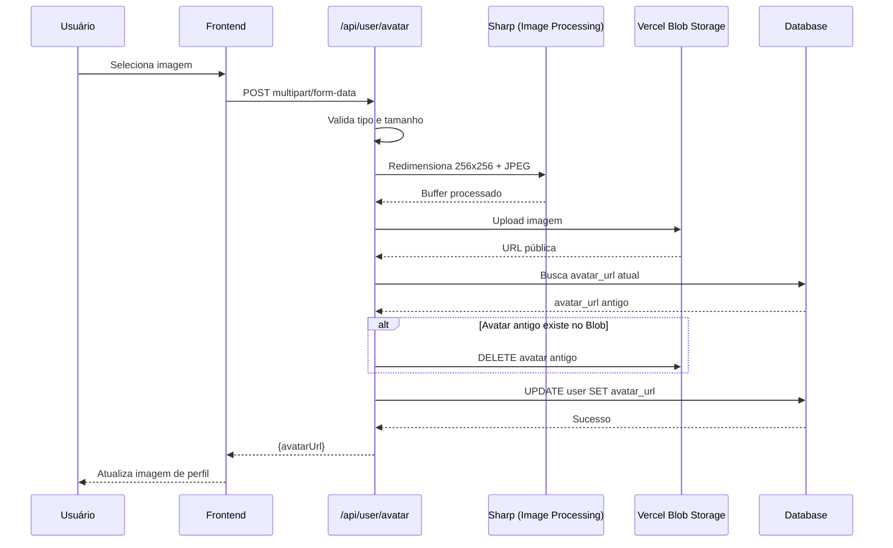

# API - Usuário

Endpoints para gerenciamento de perfil e configurações do usuário.

## Endpoints

### 1. Atualizar Nome Social

Atualiza o nome social do usuário autenticado.

**Endpoint**: `PATCH /api/user/me`

**Autenticação**: ✅ Requerida (USER ou ADMIN)

#### Request Body

```json
{
  "social_name": "string (obrigatório, não vazio)"
}
```

#### Respostas

**200 OK**

```json
{
  "socialName": "João"
}
```

**400 Bad Request** - Campo inválido

```json
{
  "error": "social_name deve ser uma string"
}
```

ou

```json
{
  "error": "Nome social não pode ser vazio"
}
```

ou

```json
{
  "error": "Nenhum campo para atualizar"
}
```

**401 Unauthorized** - Não autenticado

```json
{
  "error": "Não autorizado"
}
```

**500 Internal Server Error** - Erro do servidor

```json
{
  "error": "Erro ao atualizar usuário"
}
```

#### Observações

- O `social_name` é opcional no perfil do usuário
- Após atualizar, o nome social aparece na sessão e é usado para exibição
- O valor é automaticamente trimado (espaços em branco removidos)

---

### 2. Upload de Avatar

Faz upload de uma imagem de avatar para o usuário autenticado.

**Endpoint**: `POST /api/user/avatar`

**Autenticação**: ✅ Requerida (USER ou ADMIN)

#### Request (multipart/form-data)

- `avatar` ou `file` - Arquivo de imagem (obrigatório)

#### Validações

| Validação | Valor |
|-----------|-------|
| Tamanho máximo | 5 MB |
| Formatos aceitos | JPEG, PNG, WebP |
| Processamento | Redimensionado para 256x256px, convertido para JPEG com qualidade 80% |

#### Respostas

**200 OK**

```json
{
  "avatarUrl": "https://blob.vercel-storage.com/avatars/123-1234567890.jpg"
}
```

**400 Bad Request** - Nenhum arquivo enviado

```json
{
  "error": "Nenhum arquivo enviado. Use o campo \"avatar\" ou \"file\"."
}
```

**400 Bad Request** - Tipo não permitido

```json
{
  "error": "Tipo de arquivo não permitido. Use JPEG, PNG ou WebP."
}
```

**400 Bad Request** - Arquivo muito grande

```json
{
  "error": "Arquivo muito grande. Tamanho máximo: 5 MB."
}
```

**401 Unauthorized** - Não autenticado

```json
{
  "error": "Não autorizado"
}
```

**500 Internal Server Error** - Erro do servidor

```json
{
  "error": "Erro ao fazer upload do avatar. Tente novamente."
}
```

#### Observações

- A imagem é **processada** antes do upload:
  - Redimensionada para 256x256px (fit: cover)
  - Convertida para JPEG com qualidade 80%
- Upload é feito para **Vercel Blob Storage**
- Se o usuário já tem um avatar no Blob Storage, o antigo é **deletado** automaticamente
- A URL do avatar é salva no campo `avatar_url` do usuário
- Requer variável de ambiente `BLOB_READ_WRITE_TOKEN` configurada

---

## Fluxo de Atualização de Perfil

### Nome Social



### Avatar



---

## Exemplos de Uso

### Atualizar Nome Social via JavaScript

```typescript
const response = await fetch('/api/user/me', {
  method: 'PATCH',
  headers: {
    'Content-Type': 'application/json',
  },
  body: JSON.stringify({
    social_name: 'João',
  }),
})

const data = await response.json()

if (response.ok) {
  console.log('Nome social atualizado:', data.socialName)
} else {
  console.error('Erro:', data.error)
}
```

### Upload de Avatar via JavaScript

```typescript
const fileInput = document.querySelector('input[type="file"]')
const file = fileInput.files[0]

const formData = new FormData()
formData.append('avatar', file)

const response = await fetch('/api/user/avatar', {
  method: 'POST',
  body: formData,
})

const data = await response.json()

if (response.ok) {
  console.log('Avatar atualizado:', data.avatarUrl)
  // Atualizar imagem na UI
  document.querySelector('img.avatar').src = data.avatarUrl
} else {
  console.error('Erro:', data.error)
}
```

### Upload de Avatar via cURL

```bash
curl -X POST http://localhost:3000/api/user/avatar \
  -H "Cookie: next-auth.session-token=..." \
  -F "avatar=@/caminho/para/imagem.jpg"
```

---

## Componente React de Exemplo

### Atualizar Nome Social

```typescript
'use client'

import { useState } from 'react'

export function UpdateSocialName() {
  const [socialName, setSocialName] = useState('')
  const [loading, setLoading] = useState(false)

  const handleSubmit = async (e: React.FormEvent) => {
    e.preventDefault()
    setLoading(true)

    try {
      const res = await fetch('/api/user/me', {
        method: 'PATCH',
        headers: { 'Content-Type': 'application/json' },
        body: JSON.stringify({ social_name: socialName }),
      })

      const data = await res.json()

      if (res.ok) {
        alert('Nome social atualizado!')
      } else {
        alert(data.error)
      }
    } catch (error) {
      alert('Erro ao atualizar')
    } finally {
      setLoading(false)
    }
  }

  return (
    <form onSubmit={handleSubmit}>
      <input
        type="text"
        value={socialName}
        onChange={e => setSocialName(e.target.value)}
        placeholder="Nome social"
        required
      />
      <button type="submit" disabled={loading}>
        {loading ? 'Salvando...' : 'Salvar'}
      </button>
    </form>
  )
}
```

### Upload de Avatar

```typescript
'use client'

import { useState } from 'react'

export function AvatarUpload() {
  const [uploading, setUploading] = useState(false)
  const [avatarUrl, setAvatarUrl] = useState<string | null>(null)

  const handleFileChange = async (e: React.ChangeEvent<HTMLInputElement>) => {
    const file = e.target.files?.[0]
    if (!file) return

    // Validação client-side
    if (!['image/jpeg', 'image/png', 'image/webp'].includes(file.type)) {
      alert('Formato não suportado. Use JPEG, PNG ou WebP.')
      return
    }

    if (file.size > 5 * 1024 * 1024) {
      alert('Arquivo muito grande. Máximo: 5 MB.')
      return
    }

    setUploading(true)

    try {
      const formData = new FormData()
      formData.append('avatar', file)

      const res = await fetch('/api/user/avatar', {
        method: 'POST',
        body: formData,
      })

      const data = await res.json()

      if (res.ok) {
        setAvatarUrl(data.avatarUrl)
        alert('Avatar atualizado!')
      } else {
        alert(data.error)
      }
    } catch (error) {
      alert('Erro ao fazer upload')
    } finally {
      setUploading(false)
    }
  }

  return (
    <div>
      {avatarUrl && (
        
      )}
      <input
        type="file"
        accept="image/jpeg,image/png,image/webp"
        onChange={handleFileChange}
        disabled={uploading}
      />
      {uploading && <p>Fazendo upload...</p>}
    </div>
  )
}
```

---

## Processamento de Imagem

A biblioteca **Sharp** é usada para otimizar imagens antes do upload:

```typescript
await sharp(inputBuffer)
  .resize(256, 256, { fit: 'cover' })  // Redimensiona para 256x256
  .jpeg({ quality: 80 })               // Converte para JPEG com qualidade 80%
  .toBuffer()
```

### Benefícios

- **Performance**: Imagens menores carregam mais rápido
- **Consistência**: Todos os avatares têm o mesmo tamanho
- **Economia**: Menos espaço no Blob Storage
- **Qualidade**: Qualidade 80% mantém boa aparência com tamanho reduzido

---

## Configuração do Vercel Blob Storage

### Variável de Ambiente

```env
BLOB_READ_WRITE_TOKEN=vercel_blob_rw_...
```

### Obter Token

1. Acesse o painel Vercel
2. Vá em **Storage** > **Blob**
3. Crie um novo Blob Store (se não existir)
4. Copie o token de leitura/escrita
5. Adicione como variável de ambiente no projeto

### Estrutura de Arquivos

```
avatars/
├── 123-1234567890-abc123.jpg
├── 456-1234567891-def456.jpg
└── ...
```

Formato: `{userId}-{timestamp}-{randomSuffix}.jpg`

---

## Limitações e Melhorias Futuras

### Atuais

- Apenas nome social pode ser atualizado via `/api/user/me`
- Avatar requer Vercel Blob Storage (não funciona localmente sem configuração)

### Melhorias Sugeridas

- [ ] Permitir atualizar outros campos (igreja, nome completo)
- [ ] Adicionar endpoint para deletar avatar
- [ ] Implementar limite de uploads por usuário (rate limiting)
- [ ] Suporte a armazenamento local/S3 como alternativa ao Blob
- [ ] Validação de dimensões mínimas da imagem
- [ ] Preview do avatar antes de fazer upload
